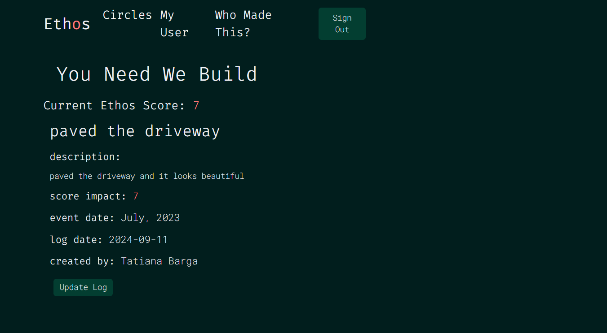
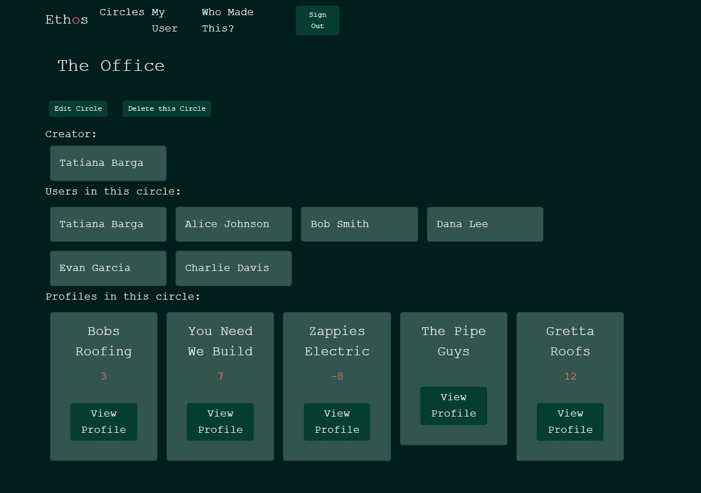

# Ethos Client-Side Repository

## Overview

**Ethos** is a full-stack web application designed to track and evaluate experiences and opinions related to corporations, politicians, contractors, individuals, and more. It provides users with a versatile platform to manage and share feedback, aiding in informed decision-making and transparency.

## Links and Resources
- [deployed project](https://ethos-client.netlify.app)
- [Video Walkthrough](https://www.loom.com/share/b4c42977a3704dd89b46817786824a8d?sid=b9f045e6-a44f-4cc4-a825-bda84029dc84)
- [Wireframe](https://www.figma.com/design/OV8zg11xjindtsnKR8iW9k/Ethos?node-id=0-1&t=LpJ6Ndp5CZLbxgIk-0)
- [Server-Side repository](https://github.com/tatianabarga/ethos-server)
- [Project Board](https://github.com/users/tatianabarga/projects/5/views/1?pane=issue&itemId=70796528)
- [Postman Documentation](https://documenter.getpostman.com/view/30237001/2sAXjJ4s76)
- [ERD](https://drawsql.app/teams/tatiana-bargas-team/diagrams/ethos)

## Features

- **Profile Management**: Create and manage profiles for entities such as contractors, corporations, and individuals.

  
- **Ethos Score**: Each profile includes an Ethos Score updated based on user feedback.

- **Experience Logging**: Document experiences with profiles, including descriptions, dates, and score impacts.

- **Circles**: Organize profiles into 'circles,' allowing shared access and collaboration on profiles and logs.

## User Description
- Use Case: Corporate users leverage Ethos to track and evaluate their experiences with contractors and service providers. By documenting and reviewing feedback, they can make informed decisions on whether to continue working with these entities or select new ones.
- Use Case: Individual users utilize Ethos to monitor and assess the actions and policies of corporations and politicians. By keeping detailed records of their experiences and observations, they can better decide which organizations and leaders align with their values and which ones to avoid. This empowers them to support ethical and responsible entities, contributing to more informed civic and consumer choices.

  
## Contributors
- [Tatiana Barga](https://github.com/tatianabarga)

## Tech Stack
- ReactJS
- Bootstrap
- Sass
- My own Python Server (linked above)

## Getting Started

#### 1. Clone your new repo to your local machine
#### 2. Go to the **NEXT** section

## Starting the Project
1. Create a Firebase project and set up authentication. Use [these videos](https://vimeo.com/showcase/codetracker-firebase) as a refresher if needed.
1. Create a `.env` file at the root of the project
1. Copy over all of your Firebase values into the `.env` file.
1. Go to the [Ethos server-side repository](https://github.com/tatianabarga/ethos-server) , clone it, and set it up in your env file. (instruction in README)
1. From your command line, be in the root directory and run `npm install` OR `npm i` for short.
1. Make sure you have the sass extension with an extension id of: syler.sass-indented
1. Make sure you have the live sass compiler extension with an extension id of: glenn2223.live-sass
1. Next, run `npm run prepare`. This command sets up husky to track eslint errors on commit that will make your deploy fail on Netlify.
1. To start your application, run `npm run dev`. THIS IS THE COMMAND YOU WILL USE TO RUN YOUR DEVELOPMENT SERVER FROM NOW ON.
1. Open [http://localhost:3000](http://localhost:3000) with your browser.

